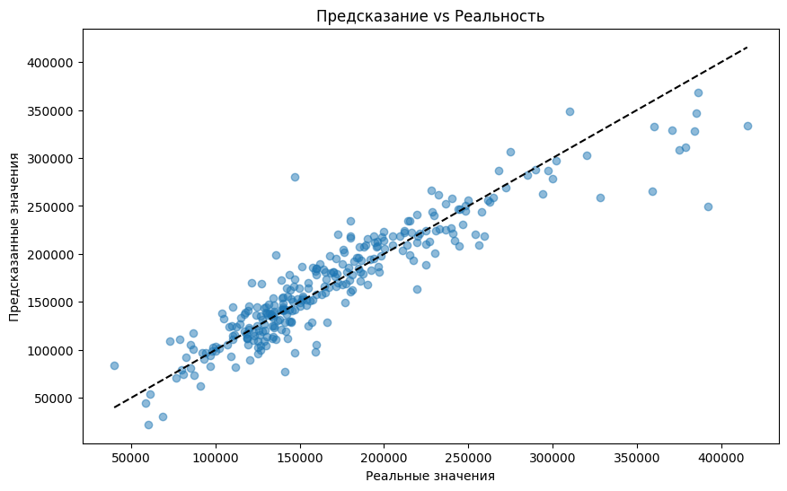

# house-price-prediction
A project to predict house prices
# House Price Prediction Project

Проект для предсказания цен на дома с использованием методов Data Science

## 🚀 Структура проекта
```
house_price_prediction/
├── data/                   # Исходные и обработанные данные
│   ├── train.csv           # Исходные данные
│   └── processed_train.csv # Очищенные данные
├── notebooks/              # Jupyter-ноутбуки
│   └── analysis.ipynb      # EDA и анализ
├── scripts/                # Исполняемые скрипты
│   ├── preprocessing.py    # Очистка данных
│   └── train_model.py      # Обучение модели
├── models/                 # Сохранённые модели
├── reports/                # Результаты и графики
└── README.md               # Этот файл
```

## ⚙️ Установка
1. Клонировать репозиторий:
   ```bash
   git clone https://github.com/ваш-username/house_price_prediction.git
   ```
2. Установить зависимости:
   ```bash
   pip install -r requirements.txt
   ```

## 🛠 Использование
1. Предобработка данных:
   ```bash
   python scripts/preprocessing.py
   ```
2. Обучение модели:
   ```bash
   python scripts/train_model.py
   ```
3. Анализ в Jupyter:
   ```bash
   jupyter notebook notebooks/analysis.ipynb
   ```

## 📊 Результаты
Пример метрики модели:
- R2 Score: 0.8509761152058919
- MSE: 645612290.7668228

Пример предсказания:


## 📝 Лицензия
MIT License

## ✉️ Контакты
Maxim Maltsev - mmaltsevmsu@gmail.com - [Telegram](https://t.me/@teachermsu)